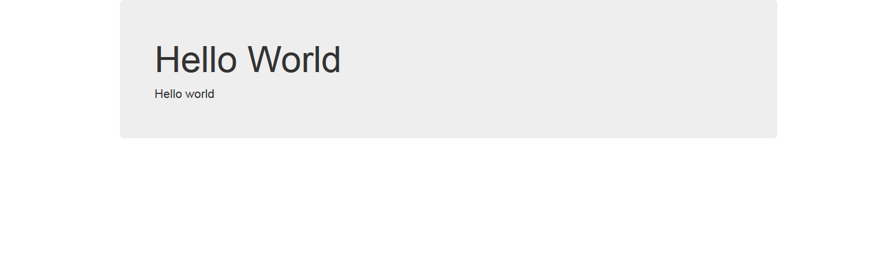

Basic-flask
===========
Basic-flask is a simple hello world app. To be used as a base to build on, cookie cutter no frills. 

Includes:

	Bootstrap 3.3.6
	Jquery 2.2.0

Requirements
-----------

	Python2.7 or Python3

Install
-------
Virtualenv or equivalent should be used.

To setup the virtual python environment and activate it:

	virtualenv venv
	. venv/bin/activate

For python3:
	
	virtualenv -p /usr/bin/python3 venv

Download and install requirements:

	clone the repository
	pip install -r requirements.txt

Running the app
---------------
Run the run.py file to start the development server, then just browse to the serverip using port 5000:

	python run.py
	http://serverip:5000/

Screenshot
----------

