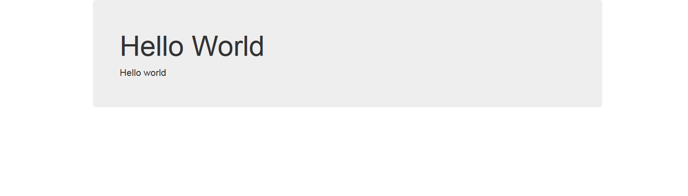

Basic-flask
===========
Basic-flask is a simple hello world app. To be used as a base to build on, cookie cutter no frills. 

Includes:

	Bootstrap 3.3.6
	Jquery 2.2.0

Requirements
-----------

	Docker

Running in a Dev Container
---------------------------
This repo includes a Dev Container config (`.devcontainer/devcontainer.json`) that builds the app's `Dockerfile`, installs dependencies, and forwards port 5000.

Open the folder in VS Code with the Dev Containers extension installed, then run "Dev Containers: Reopen in Container" from the command palette. The app will be available at:

	http://localhost:5000/

Running with Docker
--------------------
Build and run the image directly without VS Code:

	docker build -t basic-flask .
	docker run --rm -p 5000:5000 basic-flask
	http://localhost:5000/

Install (without Docker)
-------------------------
Clone the repository, then create the virtual environment and install requirements:

	uv venv
	uv pip install -r requirements.txt

Activate the virtual environment:

	. .venv/bin/activate

Running the app
---------------
Run the run.py file to start the development server, then just browse to the serverip using port 5000:

	python run.py
	http://serverip:5000/

Screenshot
----------

